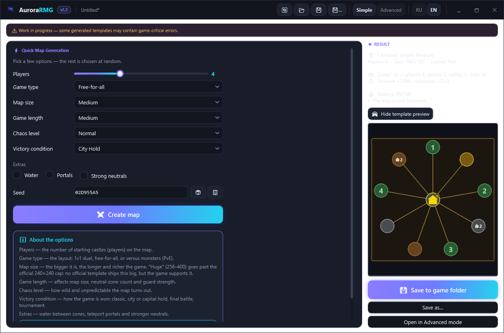

<div align="center">


### Random map template generator for **Heroes of Might and Magic: Olden Era**

[](https://github.com/sany86russ/AuroraRMG/releases/latest)
[](https://github.com/sany86russ/AuroraRMG/releases)
[](https://github.com/sany86russ/AuroraRMG/releases/latest)

**Configure your map in a friendly UI instead of hand-editing JSON — then hit "Create template".**

[📥 Download](#-installation) · [🚀 Quick start](#-quick-start) · [🧭 Interface](#-interface-overview) · [⚙️ All settings](#️-all-settings) · [🎲 Presets](#-built-in-presets-43) · [❓ FAQ](#-faq)

[Русский](README.md) · 🌍 **English**

</div>

---

> [!NOTE]
> **Based on [Olden-Era---Template-Generator](https://github.com/KhanDevelopsGames/Olden-Era---Template-Generator/) by [KhanDevelopsGames](https://github.com/KhanDevelopsGames).**
> The idea and the basic approach to building `.rmg.json` templates come from that project — thanks to the original author! AuroraRMG is a reworked version with a new look (the **Aurora** theme), full bilingual localization (**RU/EN**), a visual zone editor, an expanded set of options and its own auto-updater. See [Credits](#-credits--origin).

---

## 🆕 What's new in 1.3.4

### 🧭 "Border guards" is now discoverable in Advanced mode too (from player feedback)

1.3.3 added the **"Border guards"** setting to Simple mode, but in Advanced the same parameter had a different name — the "Border/portal strength" slider — and players couldn't find it. Fixed:

- the slider is renamed to **"Border/portal guards"** (the **"Zone Setup" tab → "◆ ZONE SETUP"** block) so it matches the Simple-mode wording;
- a hover tooltip was added: it's the same setting as "Border guards" in Simple mode (25–300%, default 100%; higher = a tougher "face-control").

How the Simple-mode levels map to the slider: **Weak** ≈ 45–80%, **Normal** ≈ 80–140%, **Strong** ≈ 150–220%, **Fortress** ≈ 230–300%.

### 🛡 Border-guard strength on zone borders *(from 1.3.3)*



**Simple Mode** gains a **"Border guards"** setting — you can now pick how strong the monster guards on the passages between zones are:

- **Weak** — passages break easily (early rushes get through);
- **Normal** — as before (old seeds are unchanged);
- **Strong** — tough gates;
- **Fortress** — a real wall: an aggressive opponent (including the AI that got smarter after the patch) stays penned in its own zone for weeks and can't rush you early — the "face-control" you asked for.

Border strength used to be Advanced-only (the "Border/portal strength" slider) — now it's right there in Simple Mode too. The actual strength (in %) is shown in the post-generation summary.

### ⚙️ Quick-generation quality *(from 1.3.2)*

- **Mines for every player.** Quick maps now guarantee starter mines (wood/ore/gold) in each player's home zone, not just one-shot resource piles — so there's a real economy.
- **Starting terrain matches the faction.** Each player's home is now on their faction's native terrain, even on themed maps (neutral zones still vary).
- **Simple → Advanced transfer.** "Open in Advanced mode" now carries the neutral-zone count across correctly (it used to show 0).

### 🗺 Manual control in the zone editor *(from 1.3.2)*

In the **visual editor** ("🗺 Editor") you can override by hand what the generator does automatically:

- **Castle or outpost.** A castle zone now has a castle ↔ outpost toggle: capturing an outpost grants the player their **native** town instead of a random castle.
- **Connections, portals and guards — precisely.** Which zones connect (e.g. parallel bronze→silver→gold corridors), which use **portals**, and the **guard strength per connection** (the "Highway" pattern). See [Visual zone editor](#-visual-zone-editor).

### 🎲 Simple Mode got cleaner *(from 1.3.1)*

- **The template preview is hidden by default.** Simple Mode now leads with the result ("what you got" + the balance score); the map structure is one click away via **"👁 Show template preview"** — so generation feels genuinely random.
- **"Reset settings" now works in Simple Mode too.** It used to reset only Advanced — now it resets Simple as well (fresh seed, cleared result).

### 🗺 Large maps — bigger than 240×240 *(from 1.3.0)*

By popular request you can now create maps larger than the old 240×240 cap — better for long, rich games.

- In **Simple Mode** — a new map size **"Huge (256–400)"**.
- In **Advanced Mode** the large-maps option **256×256 … 512×512** is now in plain sight — a highlighted checkbox right under the size picker (it existed before, but was hard to find).
- Official templates stop at 240×240, but the game engine handles larger maps.

### ⚖ Map analysis — balance & contents

After generating (in **both** modes) you immediately see **what you got** and **how fair it is**:

- **Balance score 0–100** — how equal the players' starts are (wealth, room to expand, distances, castle access), plus plain-language notes: poor start, uneven castle access, players starting too close.
- **"What's inside the map"** — zones by role (players / neutral / castles), number of links, total treasure and resources.

### 🏛 Curated landmarks

Neutral zones now reliably get **signature objects** (dragon utopias, research labs, observatories, etc.) — so a map feels designed, not merely random.

---

## 📑 Contents

- [What's new in 1.3.4](#-whats-new-in-134)
- [What is this](#-what-is-this)
- [Installation](#-installation)
- [Build authenticity verification](#-build-authenticity-verification)
- [Auto-update](#-auto-update)
- [Quick start](#-quick-start)
- [Working modes: Simple and Advanced](#-working-modes-simple-and-advanced)
- [Interface overview](#-interface-overview)
- [All settings (in detail)](#️-all-settings)
  - [Tab "Rules"](#tab--rules)
  - [Tab "Map & Zones"](#tab--map--zones)
  - [Tab "Bonuses & Bans"](#tab--bonuses--bans)
  - [Tab "Extra Content"](#tab--extra-content-exp)
- [Preview panel & generation](#-preview-panel--generation)
- [Map analysis: balance & contents](#-map-analysis-balance--contents)
- [Visual zone editor](#-visual-zone-editor)
- [UI language (RU/EN)](#-ui-language-ruen)
- [Built-in presets (43)](#-built-in-presets-43)
- [Victory conditions & special modes](#-victory-conditions--special-modes)
- [Saving & loading settings](#-saving--loading-settings)
- [Where to save templates](#-where-to-save-templates)
- [Running without disturbing the game](#-running-without-disturbing-the-game)
- [Tips & generation notes](#-tips--generation-notes)
- [FAQ](#-faq)
- [Support the creator](#-support-the-creator)
- [Credits & origin](#-credits--origin)
- [Disclaimer & license](#-disclaimer--license)

---

## 🗺 What is this

**AuroraRMG** is a Windows desktop app that creates random-map template files (`.rmg.json`) for **Heroes of Might and Magic: Olden Era**.

A map template is a set of rules the game uses to build a random map when you start a new game: how many players, how zones are connected, how many resources and towns, the terrain, how strong neutral monsters are, and so on. Such files used to be written by hand in JSON. AuroraRMG gives you a visual editor: drag sliders and toggles → press **"Create template"** → get a ready `.rmg.json` that shows up in the game's template list.

**Key features:**

| | |
|---|---|
| ⚡ **Two working modes** | **Simple** — a map in a few clicks (pick a few options → done); **Advanced** — full manual control. Toggle in the header. See [Working modes](#-working-modes-simple-and-advanced). |
| 🎲 **43 built-in presets** | 1v1 Classic, 1v1 Single-hero, FFA for 3–8 players, **PvE 1×2…1×7**, special modes — one-click load |
| 🗺 **Visual zone editor** | interactive canvas: zones, connections, inspector, PNG export — edit the map graph by hand |
| 🌍 **Two languages (RU/EN)** | instant language switch in the header, no restart; auto-detected from the OS locale |
| 🚫 **Item, spell & hero bans** | full hero roster with real names (optionally from the game's assets) |
| 🧩 **Full control** | zone topology, economy, monster strength, terrain, water, victory conditions, map size **up to 512×512** |
| ⚖ **Map analysis** | right after generation — a **balance score 0–100** + a "what's inside" breakdown (zones, links, treasure) |
| 🖼 **Map preview** | a visual schematic of zone placement and connections before you save |
| 🌑 **Aurora theme** | dark neon UI (violet → cyan) with branded menus |
| 🔄 **Auto-update** | the app finds and installs new versions from GitHub by itself |
| 📦 **Single file** | self-contained `.exe`, no installation |
| 🧭 **Auto-locate game** | finds the Olden Era templates folder via the Steam registry |

---

## 📥 Installation

1. Open the **[latest release](https://github.com/sany86russ/AuroraRMG/releases/latest)** page.
2. Download **`AuroraRMG.exe`** from the *Assets* section.
3. Run it. Done — no installation, it's a self-contained single `.exe`.

> [!IMPORTANT]
> **Requirements:** Windows 10 or 11 (64-bit). You do **not** need to install a separate .NET runtime — it's bundled inside the `.exe` (self-contained build).

> [!TIP]
> On first launch Windows SmartScreen may warn about an "unknown publisher" (the file isn't signed with a paid certificate). Click **"More info" → "Run anyway"**. The file is about 65 MB. How to verify the file is genuine — below.

---

## 🔐 Build authenticity verification

`AuroraRMG.exe` is **not signed** with a paid publisher certificate (hence the SmartScreen "unknown publisher" warning). But that **doesn't mean it can't be verified** — quite the opposite.

Every release is built **not on someone's home PC, but directly on GitHub's servers** from this open source code — the [`.github/workflows/release.yml`](.github/workflows/release.yml) workflow. During the build GitHub issues a cryptographically signed **build provenance attestation** that firmly ties the specific `.exe` to a specific commit of this repository and a specific build run.

This directly addresses the main fear: *"what if someone took the project, slipped malware into the `.exe` and re-uploaded it"*. A tampered file **won't pass verification** — it won't have a valid attestation from this repository.

**How to verify (needs the free [GitHub CLI](https://cli.github.com/)):**

```bash
gh attestation verify AuroraRMG.exe --repo sany86russ/AuroraRMG
```

If the file is genuine you'll see something like `✓ Verification succeeded!` — meaning **this** binary was built by GitHub from **this** repository's source and hasn't changed since. If verification fails, the file wasn't downloaded from here or was modified — **don't run it**.

> [!TIP]
> More on the technology: GitHub docs — [Artifact Attestations](https://docs.github.com/en/actions/concepts/security/artifact-attestations).

---

## 🔄 Auto-update

AuroraRMG can update itself, no manual downloading.

- **On every launch** the app quietly checks the latest release in this repository.
- If a newer version is available, a **banner** appears at the top of the window:

  > ✨ A new version of AuroraRMG vX.Y is available · **[Update]** · [What's new] · [Later]

- **Update** — the app downloads the new `.exe`, shows a progress window, replaces itself and restarts.
- **What's new** — opens the release page with the changelog.
- **Later** — hides the banner until the next launch.

The current version is always shown **in the window header**, in the badge next to `AuroraRMG`.

> [!NOTE]
> The update check is **skipped** if the app is started with the `--minimized` flag (see [Running without disturbing the game](#-running-without-disturbing-the-game)). If there's no internet or GitHub is unreachable, the app just keeps working.

---

## 🚀 Quick start

**Way 1 — Simple Mode (easiest, recommended for newcomers):**

1. Launch AuroraRMG — it opens in **Simple Mode** by default (the **Simple / Advanced** toggle is in the header, next to the language).
2. Pick a few options: players, game type, size, length, victory condition.
3. Click **"⚔ Create map"** — a preview and a short summary appear on the right.
4. Click **"💾 Save to game folder"** — enter a name, and the map lands straight in the game.
5. Launch Olden Era → start a new game → pick your template from the list.

More in [Working modes](#-working-modes-simple-and-advanced).

**Way 2 — via a preset (Advanced mode):**

1. Switch to **Advanced** mode.
2. On the **"Map Rules"** tab, in the **TEMPLATE** block, open the **"Preset ▾"** menu and pick a config (e.g. *"Standard"* under *1v1 — Classic*).
3. Click **"⚔ Create template"** in the right panel, then save.
4. Launch Olden Era → start a new game → pick the template.

**Way 3 — manually (Advanced mode):**

1. Set the **name**, **player count** and **map size**.
2. Go through the tabs and tune topology, zones, economy, environment.
3. Click **"⚔ Create template"** — a **preview** of the zone layout appears on the right.
4. Check the validation warnings (if any) and save the file.

---

## 🎮 Working modes: Simple and Advanced

Since **1.2.0**, AuroraRMG has **two working modes**. The **Simple / Advanced** toggle sits **in the top bar, next to the language switch (RU/EN)**. The chosen mode is remembered between launches; on first launch it opens in **Simple**.

### ⚡ Simple Mode — "a map in a few clicks"


For players who **don't want to learn templates**. You set just a few clear options — everything else is chosen at random within safe values, giving you a ready, playable map right away:

| Option | What it sets |
|---|---|
| **Players** | How many players (starting castles) are on the map. |
| **Game type** | Layout: **Duel (1×1)**, **Free-for-all**, **Versus monsters (PvE)**, **Team game** *(this mode isn't in the game yet)*. |
| **Map size** | Small / Medium / Large / **Huge (256–400)**. "Huge" goes past the official 240×240 cap (experimental), but the game engine supports it. |
| **Game length** | Short / Medium / Long — affects size, zone count and guard strength. |
| **Chaos level** | Tame / Normal / Wild — how wild and unpredictable the map gets. |
| **Victory condition** | All the real in-game modes — classic, city/capital hold, final battle, tournament (see [Victory conditions](#-victory-conditions--special-modes)). |
| **Extras** | Water, portals, stronger neutrals. |
| **Seed** 🎲 📋 | The map's fingerprint: the same seed always yields the same map. **Share the seed** to play an identical map with friends. 🎲 = new random, 📋 = copy. |

Then: **"⚔ Create map"** → a **preview** and a short **summary** (including an estimated game length, a **balance score** and a **"what's inside"** breakdown — see [Map analysis](#-map-analysis-balance--contents)) appear on the right → **"💾 Save to game folder"** (asks for a name and drops the map straight into the game) or **"Save as…"**. A **hint for every option** sits at the bottom of the window. Any map can be **"Opened in Advanced mode"** and fine-tuned by hand.

### 🛠 Advanced Mode — full control


The classic mode with **every** setting across four tabs (**Map Rules · Zone Setup · Zone Content · Bonuses & Bans**) plus the right-hand generation/preview panel. Everything is here: topology, economy, monster strength, terrain, water, victory conditions, bans, fine neutral-zone distribution, mandatory content and the **visual zone editor**. Details below in [Interface overview](#-interface-overview) and [All settings](#️-all-settings).

> 💡 **Which to pick?** Want a good random map fast — **Simple**. Want to tweak every detail — **Advanced**. You can switch any time, and a Simple-mode result can always be refined in Advanced.

---

## 🧭 Interface overview

> The section below describes **Advanced mode** (the full set of tabs). If you're in **Simple Mode**, switch with the **Advanced** button in the header. For Simple Mode see [Working modes](#-working-modes-simple-and-advanced).

The window has three areas:

```
┌──────────────────────────────────────────────────────────────┐
│  🧭 AuroraRMG  [v1.0]  —  file_name    🔄 📂 💾 💾… 🗺 RU EN  _ ☐ ✕ │   ← Header
├───────────────┬──────────────────────────────┬───────────────┤
│  Rules        │                              │  ⚔ Create      │
│  Map & Zones  │     Selected tab content     │   template     │
│  Bonuses/Bans │                              │  ┌──────────┐  │
│  Extra Content│                              │  │ map      │  │
│  …            │                              │  │ preview  │  │
│ ← navigation →│                              │  └──────────┘  │
│               │                              │  💾 Save       │
└───────────────┴──────────────────────────────┴───────────────┘
   left rail          work area                action panel
```

### Window header

| Element | Action | Shortcut |
|---|---|---|
| 🧭 **AuroraRMG** + version badge | Product name and current version | — |
| *file name* | Current settings file (`*` = unsaved changes) | — |
| 🔄 | Reset all settings (new template) | `Ctrl + N` |
| 📂 | Open saved settings | `Ctrl + O` |
| 💾 | Save settings | `Ctrl + S` |
| 💾… | Save settings as… | `Ctrl + Shift + S` |
| **Simple** / **Advanced** | Switch the working mode (Simple by default; remembered). See [Working modes](#-working-modes-simple-and-advanced) | — |
| 🗺 **Editor** | Open the visual zone editor | — |
| **RU** / **EN** | Switch UI language (instant) | — |
| `_` `☐` `✕` | Minimize / maximize / close | — |

> "Settings" (💾) is an `.oetgs` file with **all** editor parameters so you can continue later. It is **not** a game template. The game `.rmg.json` is created separately via "Create template" → "Save".

### Main tabs of Advanced mode (4)

| Tab | About |
|---|---|
| **Rules** | Basic map parameters, heroes, victory conditions, environment |
| **Map & Zones** | Topology (map shape) and detailed zone setup |
| **Bonuses & Bans** | Starting bonuses for players, banning items, spells and heroes |
| **Extra Content [EXP.]** | Guaranteed objects in zones (mines, treasures, etc.) |

### How it looks

<details open>
<summary><b>"Rules" tab</b> — basic parameters, heroes, victory conditions, environment</summary>


</details>

<details>
<summary><b>"Map & Zones" tab</b> — map topology and zone setup</summary>


</details>

<details>
<summary><b>"Bonuses & Bans" tab</b> — starting bonuses and item/spell/hero bans</summary>


</details>

<details>
<summary><b>"Extra Content [EXP.]" tab</b> — guaranteed objects in zones</summary>


</details>

> 💡 Screenshots are from the current version in the **Aurora** theme. The UI is available in Russian and English — switch in the header (RU/EN).

---

## ⚙️ All settings

> Values in parentheses are the **range** and **default**. The `[EXP.]` tag marks an experimental feature that may produce unstable results.

### Tab · "Rules"

#### "Template" block

| Setting | Description |
|---|---|
| **Preset** | A menu of 43 ready configs (grouped by mode type). Picking one fills every field instantly. See [Presets](#-built-in-presets-43). |
| **Template name** | The name the template appears under in the game. |
| **Map size** | Playfield size. Standard values roughly from 80×80 to 240×240. |
| 🗺 **Large maps: 256×256 … 512×512** `[EXP.]` | A highlighted checkbox right under the size picker — adds the larger sizes (up to 512×512) to the list. No official template ships this big, so they aren't guaranteed, but the game engine handles them (players run games at 300–400). In **Simple Mode** this corresponds to the **"Huge"** size. |
| **Players** | Number of players on the map *(2 – 8, default 2)*. |

#### "Heroes" block

| Setting | Description |
|---|---|
| **Starting hero limit** | How many heroes you can have at the start *(1 – 12, default 4)*. |
| **Max hero limit** | The hero cap *(1 – 12, default 8)*. |
| **Limit gain per town** | How much the cap grows per captured town *(0 – 10, default 1)*. |
| **Single-hero mode** | A special mode: a player has only one hero. |

> Each hero value can be set with the slider, the **−/+** buttons, or by typing a number (Enter). The maximum is **12**, matching the official game templates.

#### "Game rules" block

| Setting | Description |
|---|---|
| **Faction-laws experience** | Faction-laws XP multiplier *(25% – 200%, step 25, default 100%)*. |
| **Astrology experience** | Astrology XP multiplier *(25% – 200%, step 25, default 100%)*. |
| **Main victory condition** | The main win condition (see [table](#-victory-conditions--special-modes)). |
| **Defeat on losing the starting town** | A player is eliminated after losing their starting town. Extra slider **"Town-loss day"** *(1 – 30)* — from which day the rule is active. |
| **Defeat on losing the starting hero** | A player is eliminated after losing their starting hero. |
| **Victory by holding a neutral town** | *City Hold* mode: capture and hold a designated town. Slider **"Days to hold"** *(1 – 30, default 6)*. Details in [special modes](#-victory-conditions--special-modes). |
| **Tournament rules** | 1v1 tournament mode (2 players only). Parameters: **points to win** *(1 – 10)*, **first battle on day** *(3 – 30)*, **days between battles** *(3 – 30)*. See [special modes](#-victory-conditions--special-modes). |

#### "Environment & encounters" block

| Setting | Description |
|---|---|
| **Terrain type** | Map biome: **By faction** (a zone's terrain follows its town's faction — engine default), **Random mix** (each zone picks a biome itself), or a fixed biome: **Grass, Snow, Lava, Sand, Dirt, Deathland, Autumn**. |
| **Monster aggression** | How guards react to the player: **Passive** (more often let you pass / flee), **Normal** (default), **Aggressive** (almost always fight). |
| **Water amount** | Water borders between zones: **None / Some / Medium / Lots**. Water style matches the chosen terrain. |
| **Neutral join chance** | A diplomacy modifier for all zones: how willingly neutrals flee or join *(-1.00 … +1.00, default -0.50)*. Higher = they join the player more eagerly. |
| **Terrain roughness** | Obstacle density (rocks, forest) per zone *(0% – 200%, default 100%)*. |
| **Lake amount** | Lake coverage per zone *(0% – 200%, default 100%)*. |
| **Allow guard bypass (holes)** | Enables "holes" in guards — some guards can be passed without a fight. |

---

### Tab · "Map & Zones"

#### "Topology" block — map shape

| Topology | How zones are placed and connected |
|---|---|
| **Balanced** | Zones on concentric quality rings: players outside, neutrals inside; connections to neighbours on adjacent rings. *(default)* |
| **Random** | Zones at random positions, each connected to all bordering zones (Delaunay-triangulation based). |
| **Ring** | All zones in a circle, each linked to two neighbours. |
| **Hub** | All zones connect to a shared central hub; players never border directly. |
| **Chain** | Zones in a line from one end to the other, not closed. |

Extra (topology-dependent):

| Setting | When visible | Description |
|---|---|---|
| **Hub zone size** | "Hub" topology | Size multiplier of the central zone *(0.25× – 3×, default 1×)*. |
| **Towns in hub** | "Hub" topology | How many towns in the central hub *(0 – 4, default 0)*. |
| **Connect only via neutral zones** | when isolating | The game tries to link player zones only through neutral ones. If no neutral zone is nearby, a direct connection is made. |

#### "Zone setup" block

Base sliders (always available):

| Setting | Description |
|---|---|
| **Towns in player zones** | How many towns in each player's starting zone *(1 – 4, default 1)*. |
| ↳ **One faction for all towns in a player zone** | All towns in a player zone are the same faction (shown when >1 town). |
| ↳ **Player starts owning all towns in their zone** | The player immediately owns all towns of their zone. |
| **Towns in neutral zones** | How many towns in a neutral zone (if the zone is "with town") *(1 – 4, default 1)*. |
| **Resource frequency** | Density of resources and mines *(20% – 400%, default 100%)*. |
| **Structure frequency** | Density of structures/objects *(20% – 200%, default 100%)*. |
| **Neutral army strength** | Strength of neutral armies in zones *(25% – 300%, default 100%)*. |
| **Border/portal strength** | Guard strength on zone borders and portals *(25% – 300%, default 100%)*. |
| **Generate roads** | Adds roads between connected zones *(on by default)*. |
| **Create remote footholds** | Places remote footholds in every town zone *(on by default)*. |
| **Create extra portals** | Adds portals between non-adjacent zones. Slider **"Max portal count"** *(1 – 32, default 32)*. |

Advanced settings (the **"Advanced settings"** checkbox in the block header):

| Setting | Description |
|---|---|
| **Per-tier neutral zones** | Fine layout of neutral zones: 6 sliders *(each 0 – 30)* — **weak / medium / strong**, each in a **without-town** and **with-town** variant. Replaces the simple "Extra neutral zones" slider. Up to 32 zones total. |
| **Min. neutrals between players** | Minimum neutral zones between players *(0 – 8, default 0)*. Works if topology, zone count and portals allow it. |
| **Player zone size** `[EXP.]` | Relative weight of a player zone *(0.5× – 2×, default 1×)*. |
| **Neutral zone size** `[EXP.]` | Relative weight of a neutral zone *(0.5× – 2×, default 1×)*. |
| **Guard strength spread** | Random spread of guard strength *(0% – 50%, default 5%)*. |

> In simple mode a single **"Extra neutral zones"** slider *(0 – 30)* is available — a quick way to add neutrals without splitting them by quality.

---

### Tab · "Bonuses & Bans"

| Section | Description |
|---|---|
| **Starting bonuses** | A list of bonuses granted **equally to all players** at the start. The **`+`** button opens the bonus picker; **`×`** removes an entry. |
| **Banned items** | Artifacts that **won't appear** on the map. **`+`** — pick items (with filter and categories), **`×`** — unban. |
| **Banned spells** | Spells excluded from this map. **`+`** — pick, **`×`** — unban. |
| **Banned heroes** | Heroes that won't appear on the map (`globalBans.heroes`). Per-faction colour tags. **`+`** — pick, **`×`** — unban. |

> [!TIP]
> **Full hero roster with names.** By default a built-in verified list is available. The **"Connect the installed game's assets"** checkbox (with a clear disclaimer) loads the **full 108-hero roster with real names** straight from the installed game's local files (`Core.zip`) — nothing is uploaded to the network. The editor is fully usable without it.

---

### Tab · "Extra Content [EXP.]"

> [!WARNING]
> Experimental section. It defines **mandatory content** — objects **guaranteed** to appear in every zone of the chosen type. Overdoing it can make a map unbalanced or unplayable.

Content is configured separately for five zone types (sub-tabs):

- **Player zones**
- **Weak neutral zones**
- **Medium neutral zones**
- **Strong neutral zones**
- **Hub zones**

Within each type, objects are grouped by category:

| Category | What it is |
|---|---|
| ◆ **Mines** | Resource mines (wood, ore, gold, rare resources, etc.) |
| ◆ **Treasures** | Chests, Pandora's boxes, random artifacts |
| ◆ **Creature recruitment** | Dwellings / unit recruitment pools |
| ◆ **Resource banks** | Resource banks and stockpiles |
| ◆ **Utility structures** | Auxiliary buildings |
| ◆ **Hero development structures** | Objects that level up a hero |

For each added object you get:

| Parameter | Description |
|---|---|
| **Amount** | How many such objects in a zone *(slider, usually 0 – 5; up to 8 for treasures)*. |
| **Guarded** | The object is guarded by a neutral army. |
| **By the town** | The object is placed next to the zone's town. |
| **Road** | Distance from a road: **Any / Adjacent / Near / Medium / Far / Very far**. |

Buttons: a dropdown + **"Add"** adds a content entry; **`x`** on a row removes the object; **"Reset to defaults"** restores the standard set for the zone.

---

## 🖼 Preview panel & generation

The right column of the window:

| Element | Description |
|---|---|
| **⚔ Create template** | Generates the map from the current settings and builds its **preview**. |
| **Validation list** | If there are problems (e.g. a tournament with ≠2 players, or no City-Hold town was found) — warnings/errors show up here. Errors block saving. |
| **Map preview** | A zone schematic: placement, connections, towns; the City-Hold town is marked with a **gold house icon**. |
| **Map analysis** | Under the preview — a **balance score 0–100** with notes and a **"what's inside"** line (zones, links, treasure, resources). See [Map analysis](#-map-analysis-balance--contents). |
| **Outdated warning** | If you change settings after generation, the preview is marked outdated and must be regenerated. |
| **Save preview next to the template** | Checkbox: save the preview image in the template folder (the game may show it when picking a map). |
| **💾 Save** | Saves the finished `.rmg.json` (opens the game's templates folder by default). |

---

## ⚖ Map analysis: balance & contents

After generating (in **both** modes) AuroraRMG immediately shows a quick analysis of the resulting map — in the Simple-mode summary and in the Advanced right-hand panel. Everything is computed **locally** from the map graph; nothing is sent to the network.

### ⚖ Balance score (0–100)

How equal the players' starting conditions are. For each player it considers: the zone's **starting wealth**, nearby **room to expand** (the value of adjacent zones), the **distance to the nearest opponent** and **access to neutral castles**. The smaller the spread between players, the higher the score. Plain-language notes appear alongside, e.g.:

- "Player N starts X% poorer"
- "Uneven access to neutral castles"
- "Players N and M start close together"
- "The map is well balanced" — when everything is even

> Symmetry isn't a field in the `.rmg.json` format — it emerges from the topology. So we **measure** balance rather than impose it. For the fairest 1v1 play, pick the **Balanced** topology or the **Tournament** mode.

### 🔍 What's inside the map

The map's contents in one line: how many zones and of which kind (**players / neutral / castles**), how many **links** between them, and the total **treasure** and **resources**. Helps you gauge the scale and richness of a map before playing.

---

## 🗺 Visual zone editor

The **"🗺 Editor"** header button opens an interactive **zone-graph canvas editor** — see and edit the template's structure by hand, in the spirit of community visual editors.


- **Canvas:** zones are shown as nodes (🟢 player · 🔵 hub · 🟤/⚪/🟡 neutral by quality), connections as edges (gold = direct, dashed cyan = portal, dashed brown = road). There's a grid, a **legend** and a controls hint.
- **Navigation:** wheel to zoom (or **−/+** buttons), drag the background to pan, **"Reset view"** and **"Auto-layout"**.
- **Editing:** drag zones; the **inspector** on the right edits the selected zone (name, size, layout, diplomacy, guards, **castle/outpost**) or connection (from/to, **type**, **guard strength**, road).
- **Functions:** **➕ Zone** (or double-click the canvas), **🔗 Connect** (link two zones), **🗑 Delete** (or the `Del` key), **✓ Validate** (validation: dangling links, duplicate names, self-loops, isolated zones), **💾 Save .rmg.json** and **📂 Load**.
- **🖼 Export PNG** — save an image of the zone graph to share.
- Keys: `Del` — delete the selection, `Esc` — cancel connecting / clear the selection.

**Full manual control of the graph** (override by hand what the auto-generator does for you):

- **Which zones connect — and which don't.** Delete unwanted edges and add your own. For example, build 4 independent bronze→silver→gold "corridors" that only meet in the centre, so players clash only at the end. **✓ Validate** confirms connectivity.
- **Portals, precisely.** Select an edge → **Type = Portal**: those exact zones get a portal (instead of random ones).
- **Per-connection guard strength.** An edge has a **guard value**; a zone has a **guard multiplier**. You can do it like "Highway": a moderate entry into your own gold zone and a brutal breakthrough between two gold zones.
- **Castle or outpost.** A castle zone has a **castle ↔ outpost** toggle: capturing an outpost grants the player their **native** town instead of a random castle.

> The editor reuses the same layout as the preview, so the graph matches the generated map. Node positions are for clarity only (the `.rmg.json` stores no coordinates — the game computes them).

---

## 🌍 UI language (RU/EN)

AuroraRMG is **fully bilingual** — Russian and English.

- The **RU / EN** switch in the window header changes the language **instantly, with no restart**.
- On first launch the language is chosen from the Windows locale (Russian system → RU, otherwise EN) and then remembered.
- **Everything** is translated: tabs, buttons, labels, tooltips, descriptions, dropdown values, game-content names, preset names/descriptions, dialogs, messages and the zone editor. Logic values (SIDs, modes, tokens) are never translated — generation stays stable.

---

## 🎲 Built-in presets (43)

Presets focus first and foremost on fair 1v1 play, but there are also FFA, special modes and **PvE** (one player vs several computers). Each one is tested: an automated test verifies the generated map really matches the description. They open via the **"Preset ▾"** button — presets are grouped by mode type in a dropdown menu.

<details>
<summary><b>🗡 1v1 — Classic (20 presets)</b></summary>

| Preset | In short |
|---|---|
| Duel (fast) | Small map, ring, minimal neutrals — a quick game |
| Standard | A medium balanced map with neutrals of varying quality |
| Rich lands | More resources/structures, random terrain, aggressive neutrals |
| City hold | Win by holding the central neutral town (City Hold) |
| Tournament | Isolated mirrored clusters, a series of battles |
| Islands (water) | Zones separated by water, focus on scouting and portals |
| Hub | All zones around a shared centre, players don't border directly |
| Chain | A linear map from player to player |
| Isolation | Meeting only through neutral zones |
| Snowy | A snowy terrain across the whole map |
| Lava | Scorched lands, aggressive monsters |
| Desert | Sandy open spaces, few obstacles |
| Hardcore | Strong guards, aggressive monsters, rugged terrain |
| Peaceful (economy) | Passive monsters, weak guards, a fast start |
| Two towns | Start with two towns of your faction |
| Hub treasury | A rich guarded centre — a race for the centre |
| Portals | Player isolation + lots of portals |
| Mega-rich (sandbox) | Maximum resources/structures, two starting towns |
| Asceticism (survival) | Few resources, strong neutrals — a fight for every mine |
| Deep water | Wide water borders and portals — a naval map |

</details>

<details>
<summary><b>🛡 1v1 — Single hero (9 presets)</b></summary>

| Preset | In short |
|---|---|
| Blitz | One hero, small map — very fast |
| Duel | One hero, medium map, balanced neutrals |
| Epic | One hero, large map, lots of neutrals and aggression |
| Hub | One hero, central hub |
| Snow blitz | One hero, small snowy map |
| Tournament | One hero, 1v1 tournament mode |
| City hold | One hero, win by holding the centre |
| Islands | One hero, zones across water + portals |
| Chain | One hero, linear map |

</details>

<details>
<summary><b>👥 FFA / multiplayer & special modes (8 presets)</b></summary>

| Preset | In short |
|---|---|
| FFA 3 players — Classic | Three for themselves, a balanced map |
| FFA 4 players — Classic | Four, a medium-large map |
| FFA 4 players — Hub | Four around a shared centre |
| FFA 6 players — Ring | Six on a ring |
| FFA 8 players — Large | Eight on a large map |
| FFA 8 players — Hub | Eight around one big hub |
| King of the Hill (4 players) | Win by holding the central hub town |
| Massacre — fast FFA (4) | Small map, everything close, plenty of resources |

</details>

<details>
<summary><b>🤖 PvE — 1 vs AI (6 presets)</b></summary>

For those who like to fight against computers. One player against several AIs on a balanced map; map size and the number of neutrals grow with the number of sides.

| Preset | In short |
|---|---|
| 1 vs 2 | One player against two computers (3 sides) |
| 1 vs 3 | One player against three computers (4 sides) |
| 1 vs 4 | One player against four computers (5 sides) |
| 1 vs 5 | One player against five computers (6 sides) |
| 1 vs 6 | One player against six computers (7 sides) |
| 1 vs 7 | One player against seven computers (8 sides) |

</details>

---

## 🏆 Victory conditions & special modes

**Main victory conditions** (the "Main victory condition" dropdown):

| Condition | Description |
|---|---|
| **Standard** | Destroy all opponents. |
| **Accumulate resources** | Win by accumulating resources. |
| **Accumulate gold** | Win by accumulating gold. |
| **Capture a specified town** | Win by capturing a specific town. |
| **City Hold** | Capture and hold a designated town (City Hold). |
| **Tournament** | Tournament mode (a series of battles). |

You can additionally enable **defeat on losing the starting town/hero** — independent of the main condition.

### 🏰 City Hold

Capture a designated town and hold it for a set number of days.

- The town is chosen **automatically** by topology:
  - **Hub** → the central hub becomes the town;
  - **other topologies** → the highest-quality neutral zone, as equidistant as possible from all players, is chosen.
- The town is marked with a **gold house icon** on the preview.
- If a suitable town can't be determined, generation is blocked (you'll see a message in validation).

### ⚔ Tournament

A competitive 1v1 mode with an isolated prep phase.

- Available **only with exactly 2 players** — otherwise generation is blocked.
- Each player starts in a **fully isolated cluster**; you can't reach the opponent until the tournament begins.
- Neutral zones are **balanced by quality** between the sides.
- The order of zones in a cluster is **random but mirrored** — both players get the same layout.
- Supports topologies: **Chain/Ring** (two mirrored chains), **Random** (two mirrored clusters), **Hub** (each gets a private hub).
- Parameters: **first battle on day**, **days between battles**, **points to win**.

---

## 💾 Saving & loading settings

Tell the two file types apart:

| File | What it is | How to create |
|---|---|---|
| **`.oetgs`** (settings) | The full editor state — to continue tuning later | 💾 / 💾… in the header (`Ctrl+S` / `Ctrl+Shift+S`) |
| **`.rmg.json`** (template) | A finished game map template | **"Create template" → "Save"** |

Open previously saved settings — 📂 (`Ctrl+O`). Reset everything to defaults — 🔄 (`Ctrl+N`).

---

## 📂 Where to save templates

Game templates `.rmg.json` live here:

```
<Olden Era install folder>\HeroesOldenEra_Data\StreamingAssets\map_templates
```

> AuroraRMG tries to **find** this folder via the Steam registry and open the save dialog right there. If the game is installed in a non-standard place (another drive, a custom Steam library) — just point to the path manually in the dialog.

> 💡 In **Simple Mode** the **"💾 Save to game folder"** button drops the map into this folder automatically (it just asks for a name) — no path picking needed.

After saving, launch Olden Era and pick the template when creating a new game.

---

## 🎮 Running without disturbing the game

If you want to keep the generator handy while playing fullscreen, start it with the **`--minimized`** flag (or `-m`, or `/min`):

```
AuroraRMG.exe --minimized
```

In this mode the window starts **minimized to the taskbar without stealing focus** — it won't pop over a fullscreen game. The update check is **skipped** for this launch.

---

## 💡 Tips & generation notes

Tips based on how the generator and the Olden Era engine work — they help you get working, balanced maps.

### Workflow

- **First "Create template", then "Save".** The "⚔ Create template" button builds the map and preview; "💾 Save" writes the `.rmg.json`. Until a preview is built there's nothing to save.
- **The preview "goes stale" when settings change.** If you change any parameter after generating, the preview is marked outdated and the save button is blocked — just press "Create template" again.
- **Watch the validation list** in the right panel: yellow items are warnings, red ones are errors that block saving.

### Zones and economy

> [!TIP]
> **Neutral zones.** In simple mode one "Extra neutral zones" slider is enough. If you need an exact mix — enable **"Advanced settings"** and split zones by quality (weak/medium/strong × with/without town). Without at least one neutral zone the map will consist only of player zones.

- **Neutral zone quality** = how rich and heavily guarded it is. "Strong" zones give better rewards, but their guards are tougher.
- **"Towns in neutral zones"** only applies to zones flagged "with town".
- **The economy** is easiest to tune with three sliders: "Resource frequency", "Structure frequency" and "Neutral army strength". For a sandbox — crank resources up and army strength down; for hardcore — the opposite.
- **Signature landmarks.** Neutral zones are guaranteed one notable object matching the zone's tier (dragon utopias, research labs, observatories, etc.) — so a map feels designed, not merely random.

### Terrain and the engine

> [!NOTE]
> Olden Era has exactly **7 biomes** (Grass, Snow, Lava, Sand, Dirt, Deathland, Autumn). **There are no underground or multi-level maps.** There's also no "symmetry" field — symmetry emerges naturally from the chosen topology.

- **"Terrain type → By faction"** is the engine's default behaviour: a zone's terrain is determined by its town's faction. There's no separate "faction picker per zone" in the editor — the engine assigns towns itself.
- **"Water amount"** adds water borders between zones; the water style matches the chosen biome. For naval maps combine water with portals.

### Special modes

> [!IMPORTANT]
> - **Tournament** is available **only with 2 players** — otherwise generation is blocked.
> - **City Hold**: the town is chosen automatically (the hub for "Hub" topology, otherwise the highest-quality equidistant neutral zone). If there's no suitable town, generation is blocked — check validation.

- **Bans and bonuses are global:** banned items/spells are excluded from the entire map, and starting bonuses are granted **equally to all players**.

### Experimental features `[EXP.]`

> [!WARNING]
> Anything tagged `[EXP.]` isn't fully tested and may produce broken maps:
> - **Large maps** (256×256 … 512×512): no official template ships this big; the game engine handles them (players run games at 300–400), but behaviour on the very largest (near 512) isn't guaranteed.
> - **Zone fine-tuning** (zone sizes, guard spread) and **mandatory "Extra Content"**: the generator places content *where possible* and is limited by free space. Overdoing mandatory content breaks balance, especially on small maps and with small player zones.

> [!CAUTION]
> The generator only guarantees a valid `.rmg.json`. **In-game playability is not guaranteed** — the project is in active development (hence the "Work in progress" warning in the header). Test new templates in a quick game before playing seriously.

### Technical details

- **The `.rmg.json` format** is a template (generation rules), not a finished map. The game builds a concrete map from the template when a game starts, anew each time.
- **Map sizes** in the dropdown are tagged with letters: S / M / L / XL / H (huge) / G (giant) / C (colossal — experimental).
- **The `.exe` is self-contained** (single-file, self-contained): the .NET runtime is bundled, nothing to install.
- **Auto-detecting the game path** goes through the Steam registry; for a non-standard install you can set the path manually in the save dialog.

---

## ❓ FAQ

**What's the difference between Simple and Advanced mode?**
**Simple** — pick a few basic options and hit "Create map"; everything else is chosen automatically (great for a quick game). **Advanced** — full manual control over every parameter across four tabs. The toggle is in the header, next to the language; it opens in Simple by default. A Simple-mode map can be "Opened in Advanced" and refined. More: [Working modes](#-working-modes-simple-and-advanced).

**What is the "seed" in Simple Mode?**
It's the map's fingerprint. The same seed always yields the same map, so it's handy to share: a friend enters the same seed and plays an identical map. The 🎲 button rolls a new random seed, 📋 copies the current one.

**Can I create maps bigger than 240×240?**
Yes. In **Simple Mode** pick the **"Huge (256–400)"** size; in **Advanced** tick **"🗺 Large maps: 256×256 … 512×512"** right under the size picker — the larger sizes (up to 512×512) appear in the list. Official templates stop at 240×240, but the game engine handles larger maps (which is why the option is marked experimental).

**What does "Balance: NN/100" mean?**
It's a measure of how equal the players' starting conditions are (wealth, room to expand, distances, castle access). The higher, the fairer the map; specific notes appear alongside. More: [Map analysis](#-map-analysis-balance--contents).

**The game doesn't see my template.**
Make sure the `.rmg.json` sits exactly in `…\HeroesOldenEra_Data\StreamingAssets\map_templates` and restart the game.

**SmartScreen warns about the `.exe`.**
The file isn't certificate-signed — normal for a small tool. "More info" → "Run anyway".

**"Create template" saves nothing.**
First click **"Create template"** (the preview is built), then **"Save"**. Check the validation list — red items block saving.

**The map looks odd / empty / unbalanced.**
Most likely experimental features are in play (large maps, zone fine-tuning, mandatory content). Try a preset or reset values to defaults.

**No update is offered.**
The check runs at launch and needs internet; with the `--minimized` flag it's disabled. The current version is shown in the header. You can always download a fresh `.exe` from the [releases page](https://github.com/sany86russ/AuroraRMG/releases/latest) manually.

**Do I need a separate .NET?**
No. The runtime is bundled in the `.exe`.

---

## 💜 Support the creator

AuroraRMG is developed in spare time and distributed **for free**. If the tool turned out useful, you can support development with crypto. Any amount motivates adding new features and presets. Thanks! 🙌

<table>
<tr>
<th align="center" width="50%">

### ₿ Bitcoin (BTC)

</th>
<th align="center" width="50%">

### ₮ Tether (USDT)

</th>
</tr>
<tr>
<td align="center">


Network: **Bitcoin**

</td>
<td align="center">


Network: **Tron (TRC20)**

</td>
</tr>
<tr>
<td align="center">

```
1GFcHvGPchDf6fgAqqtyZrEkFbVcrnWFgQ
```

</td>
<td align="center">

```
TEByALUzbYKWCYvyKPiAKrErs8ba6gc4Bo
```

</td>
</tr>
</table>

> [!WARNING]
> Send **strictly on the stated network**: BTC — only the **Bitcoin** network, USDT — only **Tron (TRC20)**. Sending on a different network or to a contract address will lose the funds. Double-check the address before sending (you can scan the QR code).

---

## 🙏 Credits & origin

AuroraRMG is based on **[Olden-Era---Template-Generator](https://github.com/KhanDevelopsGames/Olden-Era---Template-Generator/)** by **[KhanDevelopsGames](https://github.com/KhanDevelopsGames)**.

That's where the very idea and the basic approach to programmatically building `.rmg.json` templates for Olden Era come from. Huge thanks to the original author for the initial work! 🙌

What was added and reworked in AuroraRMG (as of version **1.0.0**):

- 🌑 a new look — the dark neon **Aurora** theme, a new icon/logo and branded menus;
- 🌍 **full bilingual localization (RU/EN)** with an instant language switch in the header;
- 🗺 a **visual zone-graph editor** (canvas, inspector, validation, PNG export);
- 🚫 **hero bans** (full roster with names from the game assets) on top of item and spell bans;
- 🎲 a set of **43 built-in presets** (incl. **PvE 1×2…1×7**) with matching auto-tests, grouped in a menu;
- ⚙️ expanded environment options (terrain, aggression, water, diplomacy, lakes, holes) and zone fine-tuning;
- 🦸 reworked hero-limit input (slider + −/+ buttons + field, max 12);
- 🔄 a built-in **auto-update** system + a CI build with **provenance attestation**.

---

## ⚠️ Disclaimer & license

> A tool for quickly generating random map templates with custom settings. Some edge cases may be handled imperfectly — bugs are possible. Features marked `[EXP.]` aren't fully tested and may produce broken or unplayable maps.
>
> This project is **not affiliated** with or endorsed by the developers of Heroes of Might and Magic: Olden Era. Use generated templates at your own risk.

License: [MIT](LICENSE).

<div align="center">

---

**[⬆ Top](#auroramrg)** · [📥 Download the latest version](https://github.com/sany86russ/AuroraRMG/releases/latest)

</div>
